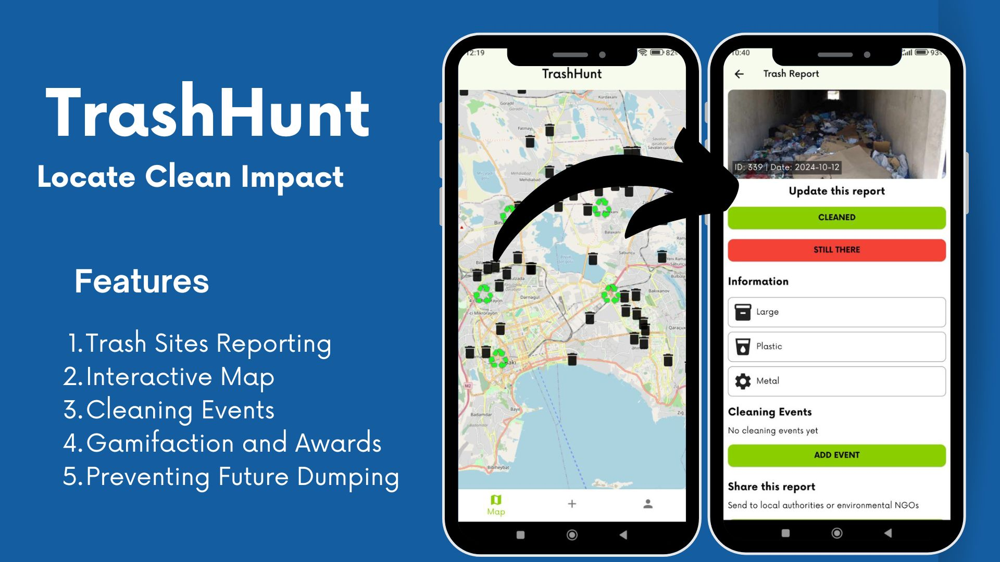
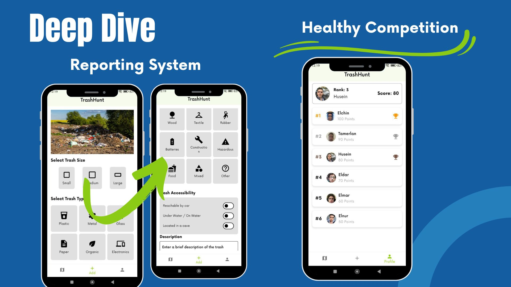

# TrashHunt 🌍♻️
A mobile app to help reduce garbage in cities by leveraging AI and community engagement

# Overview
TrashHunt is a community-driven mobile application aimed at decreasing the amount of garbage in urban areas. Users can take photos of trash they encounter, and AI analyzes these images, helping volunteer organizations and individuals clean up high-trash areas. Users earn bonuses by participating in cleanups, which they can exchange for products provided by sponsors.

# How it Works
* Take a Photo: Users capture an image of garbage they encounter.
* Submit the Report: The image is uploaded, along with the user's location and additional details, to the database.
* AI Analysis: Our AI models analyze the data to identify trash hotspots and ensure valid reports.
* Organize Clean-ups: Volunteer organizations receive notifications about high-trash areas and can organize clean-ups.
* Earn & Redeem Points: Users earn bonuses for reporting and helping clean up. These points can be exchanged for products from sponsors.

# Features
* Report Trash: Capture images of garbage and submit them to our database.
* AI Trash Analysis: AI models analyze images and user-reported data to predict the areas with the highest concentrations of trash.
* Spam Detection: The AI ensures users are submitting valid reports by detecting spam or fake submissions.
* Volunteer Collaboration: Organizations and individuals can view trash reports and organize clean-up efforts.
* Earn Bonuses: Users earn points for reporting and participating in clean-up efforts. Points can be redeemed for products from sponsors.
* Community Impact: This app fosters collaboration between volunteers, local authorities, and sponsors to keep cities clean.

# Technology Stack
* Flutter: For building cross-platform mobile apps.
* Dart: For mobile app logic and functionality.
* AI: Machine learning models for image analysis and spam detection.
